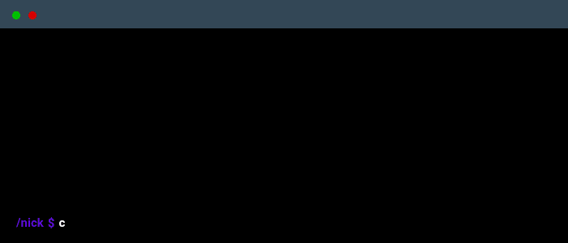
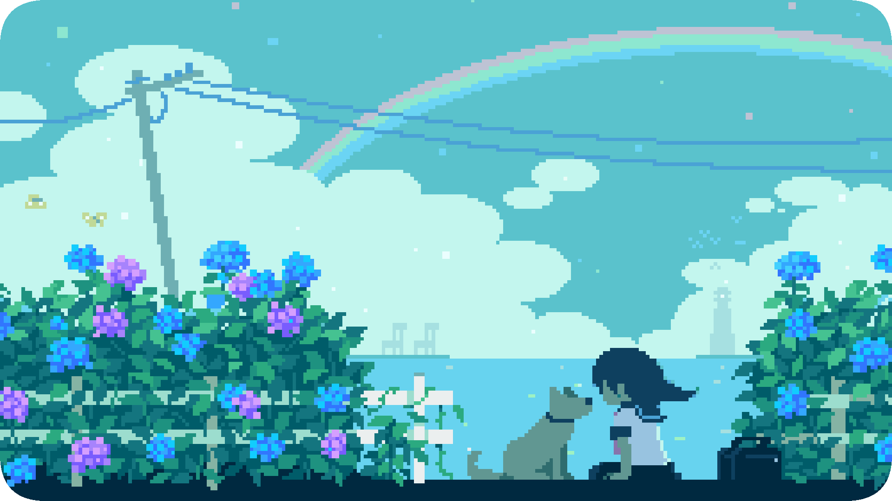

 

    

### Main skills

### Studying

### Social Media

 
  
  

> [!IMPORTANT]  
> <a href="https://i.postimg.cc/CKb6QXqD/77b98b42bb1f00c8ed3eaec8359d1c36.png" download>Download my resume</a>

 
