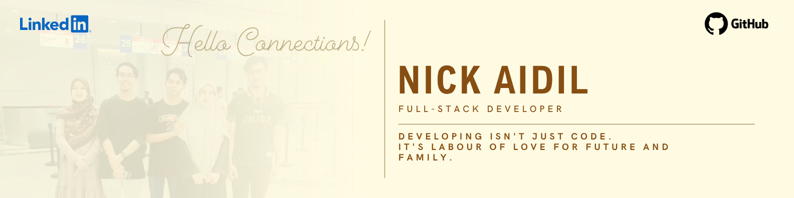
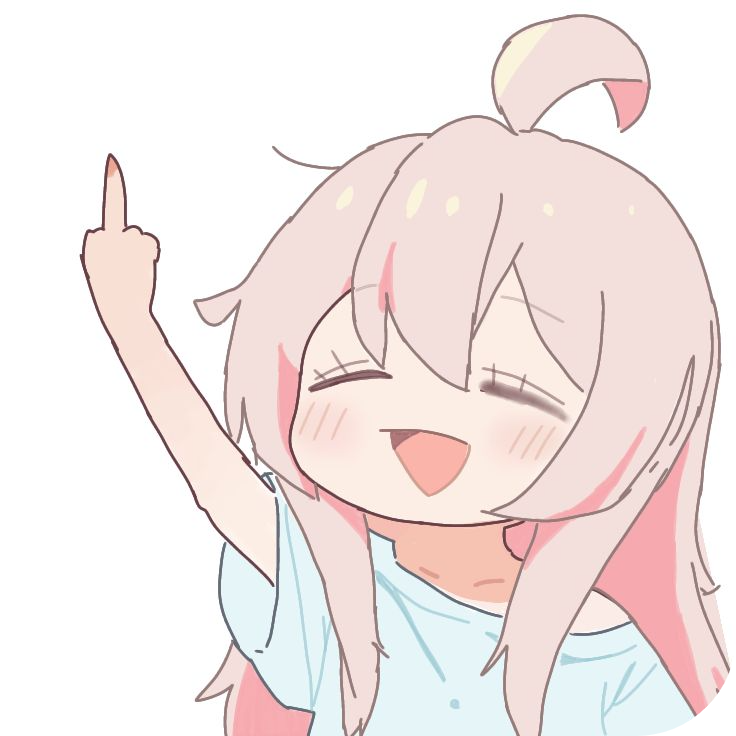
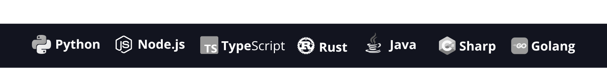

 

# Hello Connections!

I am Nick Aidil a developer focused on building high-performance infrastructure, specifically within the Discord ecosystem.

Believe in the art of keeping chaos at bay through precision and modular design. My goal is to build reliable, distributed systems that ensure maximum performance and seamless connectivity.

> [!NOTE]
> Check out our latest project at **[discordquest.com](https://discordquest.com)**

 

<table border="0">
<tr>
<td width="60%" valign="top">
<h2>Discord Profile Activity</h2>

Currently active in the Discord developer ecosystem, focusing on <b>high-performance automation</b> and <b>distributed systems</b>.

<ul>
<li><b>Building:</b> Developing the <b>Yuki Suou</b> bot and modular Discord tools using <b>Rust</b>.</li>
<li><b>Monitoring:</b> Managing <b>discordquest.com</b> to automate and track Discord Quests globally.</li>
<li><b>Optimizing:</b> Researching low-latency audio relays and high-efficiency voice gateways.</li>
<li><b>Community:</b> Part of the <b>KH1EV Development</b> and <b>Discord ID</b> team</li>
</ul>

<i>"Dengan nama Allah, Yang Maha Pemurah, lagi Maha Penyayang."</i>

</td>
<td width="40%" valign="top" align="center">

  

</td>
</tr>
</table>

## Lets Connects!~

  
  
  

    

  

